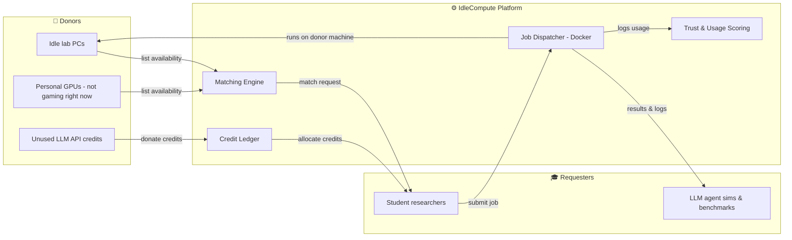
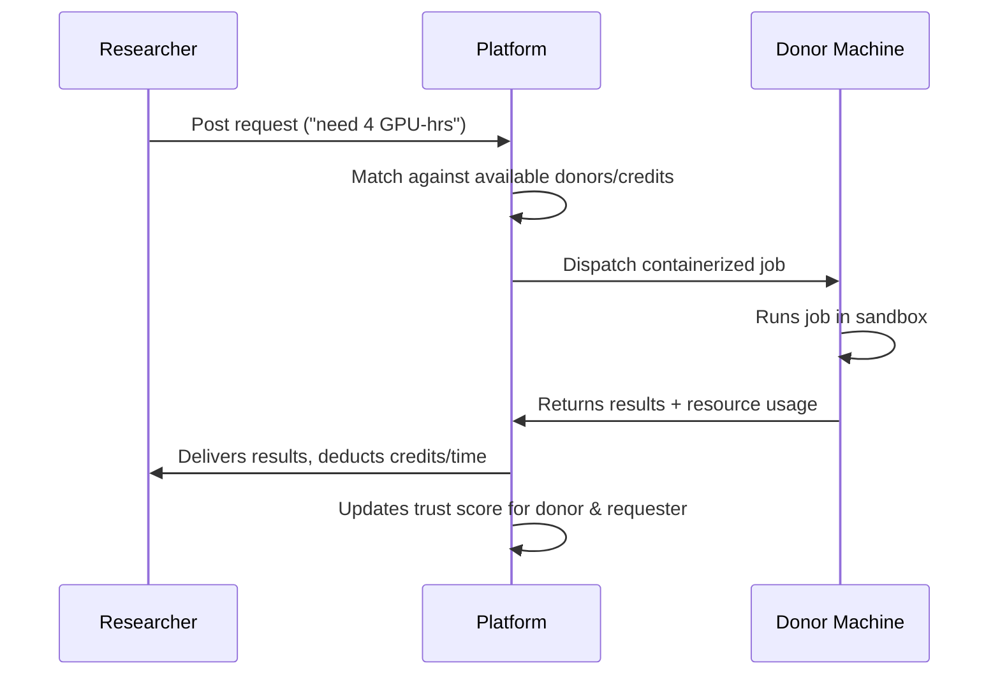

# IdleCompute

**Idle machines, unused credits, and the students who could actually use them.**

> Track: **Inclusive Innovation — Access Without Limits**
> Status: 🚧 v1 — Hackathon Build (Offline Round)
> Team Lead (remote): **Jeevandas** — Integrated M.Tech, AI & Data Science, Cochin University of Science and Technology

---

## 📌 A note for the team (read this first)

I'm not on-site for this round, so this README is doing double duty — it's both the project doc and how I'm staying in sync with the team and organizers. Please:

- Keep this file updated as things change during the build — especially the **Status** section below.
- If something's blocked or a design decision needs to be made on the spot, note it under **Open Questions / Decisions Needed** so I can weigh in async, and don't let it stall the build.
- If organizers or judges ask anything about scope, architecture, or the "why" of the project, everything here should have you covered — but ping me if something's missing.

---

## 🧩 The Problem

We are computer science students, as well as potential researchers — but researchers who kept hitting a wall that had nothing to do with our ideas, and everything to do with our bank accounts.

Running modern AI/ML experiments — loading LLM agents, running multi-agent simulations, benchmarking against state-of-the-art models — requires real compute and, often, paid API credits. Meanwhile:

- University lab machines sit idle for most of the day.
- Personal gaming PCs go untouched for hours at a time.
- Free-tier and promotional LLM API credits expire unused, all the time.

The compute isn't scarce — it's just sitting in the wrong place. Access to research ends up depending on budget, not on the quality of the idea.

## 💡 The Solution

**IdleCompute** is a peer-to-peer platform that routes idle compute and unused LLM credits to the student researchers who need them, through two connected mechanisms:

1. **Hardware Lending Network** — donors (lab machines, personal GPUs) list idle time windows; researchers get matched automatically for a specific, time-boxed job.
2. **LLM Credit Donation Pool** — unused API credits get pooled and allocated to researchers for specific experiments, instead of being wasted or paid for out of pocket.

Every job runs sandboxed in a Docker container on the donor's machine, so donors keep full control of their hardware. A transparent ledger tracks every credit donated and used, and a trust score builds up over time for both sides.

---

## 🏗️ System Architecture



### Request Lifecycle



### Data Model (simplified)

| Entity | Key Fields | Notes |
|---|---|---|
| `User` | id, name, role, trust_score | A user can be a donor, requester, or both |
| `Listing` | id, owner_id, specs, available_from/to | Hardware availability posted by a donor |
| `CreditGrant` | id, donor_id, provider, amount, expiry | Donated LLM API credits |
| `Request` | id, requester_id, job_spec, status | A researcher's compute/credit request |
| `Job` | id, request_id, listing_id/credit_id, logs, result_url | A Job resolves to *either* a Listing or a CreditGrant, not both (v1 scope) |

---

## 🛠️ Tech Stack

| Layer | Technology | Purpose |
|---|---|---|
| Frontend | React / Next.js | Dashboard, request forms, listing management |
| Backend | FastAPI (Python) or Node.js | Matching logic, API layer, request lifecycle |
| Database | PostgreSQL | Credit ledger, listings, request history |
| Job Isolation | Docker | Sandboxed job execution on donor machines |
| Real-time (stretch) | WebSockets | Live job status updates |

> **Team: update this table** once the actual stack decisions are locked in — this reflects the plan as of the design doc, not necessarily what's implemented yet.

---

## ✅ v1 Scope (what we're actually demoing)

- [x] Matching engine — request/listing UI, auto-match logic
- [x] Credit ledger — donation + allocation flow
- [ ] Job dispatch — simulated or lightly-functional, showing the full request → match → run → result loop
- [ ] Trust & usage scoring — stretch goal if time allows

**Not in v1 (post-hackathon roadmap):**
- Full trust-and-reliability scoring system
- Multi-node job scheduling and load balancing
- Institution-level pilot with a real university lab network
- Expanded LLM provider integrations for credit donation

> **Team: check these boxes off as you complete them** so I can track progress remotely without needing to ask.

---

## 🚦 Current Status

*(Update this section live during the hackathon — last updated: _______)*

| Component | Status | Owner | Notes |
|---|---|---|---|
| Matching engine | 🔲 Not started / 🟡 In progress / 🟢 Done | | |
| Credit ledger | 🔲 / 🟡 / 🟢 | | |
| Job dispatch (demo) | 🔲 / 🟡 / 🟢 | | |
| Frontend UI | 🔲 / 🟡 / 🟢 | | |
| Pitch deck / demo script | 🔲 / 🟡 / 🟢 | | |

## ❓ Open Questions / Decisions Needed

*(Add anything blocking progress here — I'll check this periodically and respond async)*

- [ ] Example: FastAPI vs Node for backend — final call?
- [ ] Example: Do we fake job dispatch entirely for the demo, or run one real job live?

---

## 🚀 Getting Started (once code is up)

```bash
# clone the repo
git clone <repo-url>
cd idlecompute

# backend
cd backend
pip install -r requirements.txt --break-system-packages
uvicorn main:app --reload

# frontend
cd ../frontend
npm install
npm run dev
```

> **Team: replace this with real setup steps** once the repo structure is finalized — this is a placeholder based on the planned stack.

---

## 👥 Team

| Name | Role | Contact |
|---|---|---|
| Jeevandas | Team Lead / Research & Concept (remote) | |
| _______ | | |
| _______ | | |
| _______ | | |

---

## 🎯 Why This Matters

By routing existing idle capacity to student researchers, IdleCompute shifts the core constraint on research participation from *financial access* back to *quality of idea* — without requiring anyone to buy new hardware or spend more money.

The compute already exists. It's just sitting in the wrong place.

---

*Built for Inclusive Innovation — Access Without Limits.*
